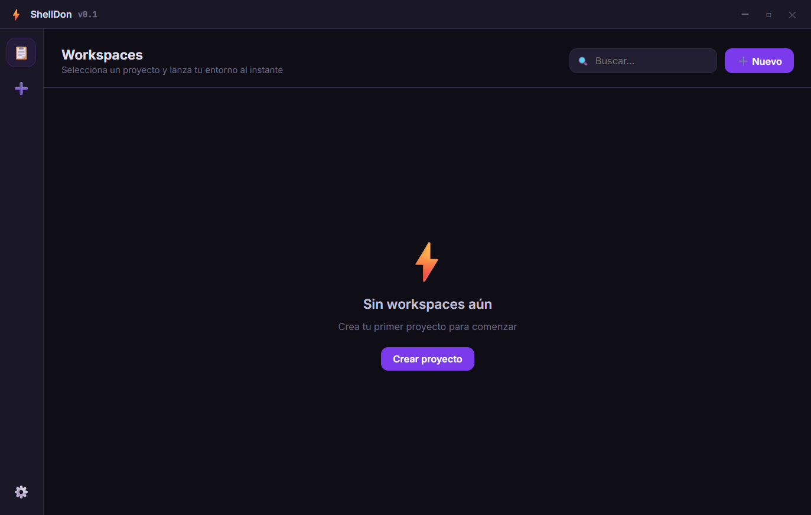
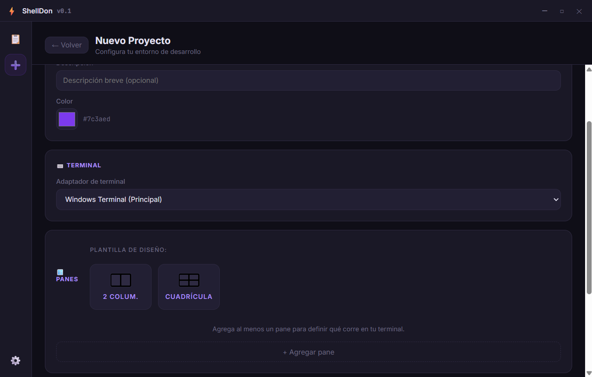

<div align="center">
  
  <h1>ShellDon ⚡</h1>

  <p><strong>Workspaces</strong></p>

  <p>
    
    
    
  </p>
</div>

---

ShellDon es una aplicación de escritorio y herramienta CLI desarrollada con Rust, Tauri y JavaScript cuyo objetivo es simplificar la preparación de espacios de trabajo para desarrolladores.

Permite definir proyectos mediante configuraciones reutilizables para centralizar directorios, comandos y futuras sesiones de terminal en un único lugar.

La visión del proyecto es reducir el tiempo dedicado a tareas repetitivas y facilitar la puesta en marcha de entornos de desarrollo complejos mediante una experiencia simple, rápida y multiplataforma.

---

## Capturas

### Interfaz Principal

<p align="center">
  
</p>

### Crear Proyecto

<p align="center">
  
</p>

---

## Características

### Actualmente disponibles

- Interfaz gráfica de escritorio mediante Tauri.
- Sistema de configuración basado en JSON.
- Gestión de proyectos.
- Arquitectura modular en Rust.
- CLI integrada para administración de configuraciones.
- Compatibilidad inicial con Windows, Linux y macOS.

### En desarrollo

- Apertura automática de terminales.
- Ejecución de múltiples comandos por proyecto.
- Gestión de paneles divididos.
- Integración avanzada con terminales nativas.
- Validación de configuraciones.

---

## Tecnologías

### Backend

- Rust
- Tauri

### Frontend

- HTML
- CSS
- JavaScript

---

## Instalación

### Requisitos

- Rust (estable)
- Node.js 20+
- npm
- Tauri CLI

### Clonar el repositorio

```bash
git clone https://github.com/xhectorcr/shelldon.git
cd shelldon
```

### Instalar dependencias

```bash
npm install
```

### Ejecutar en desarrollo

```bash
npm run tauri dev
```

### Generar compilación

```bash
npm run tauri build
```

---

## Uso

### Interfaz gráfica

1. Inicia ShellDon.
2. Crea o selecciona un proyecto.
3. Configura directorios y comandos.
4. Guarda la configuración.

---

## Licencia

Este proyecto está bajo la licencia MIT. Puedes editar y distribuir esta plantilla como desees.

Consulta el archivo [`LICENSE`](./LICENSE.md) para más información.
